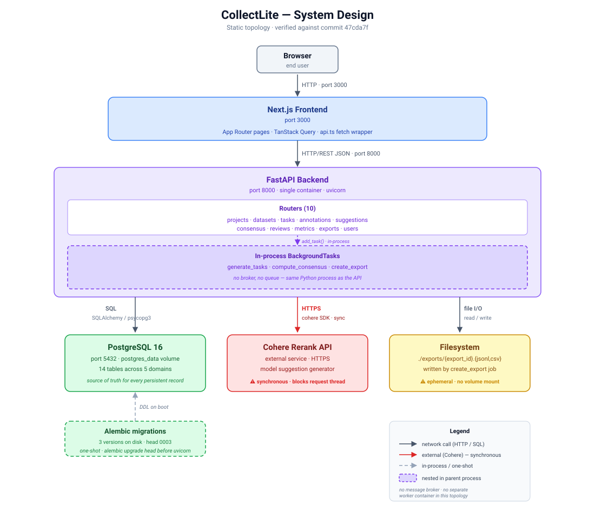
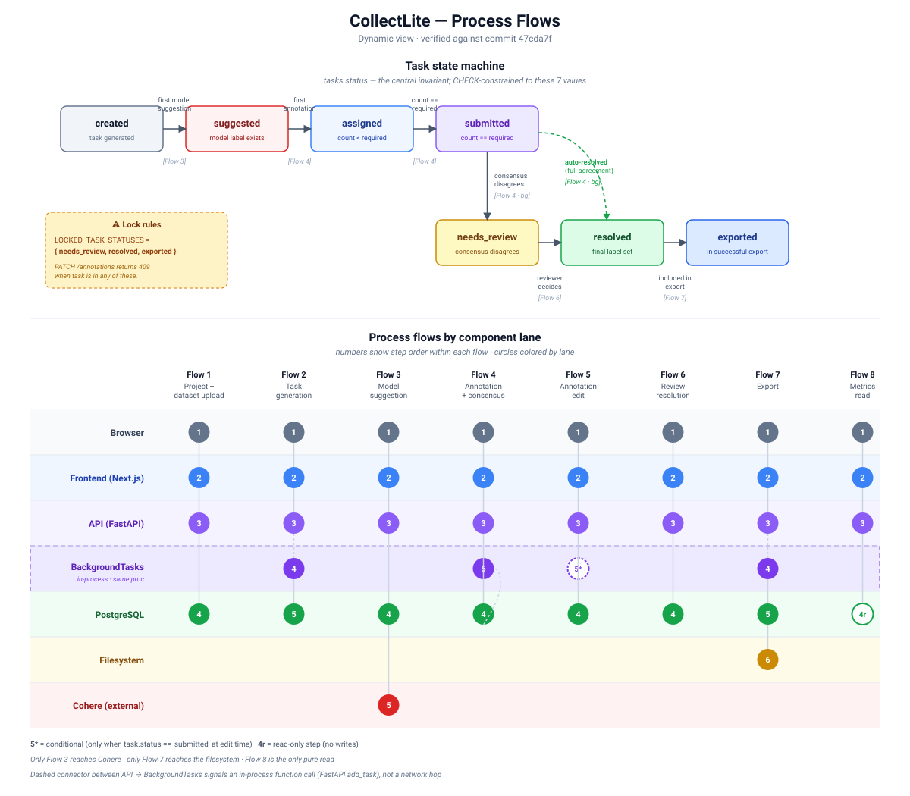

# CollectLite — Project Description and System Design

CollectLite is a full-stack human-data collection and model-evaluation platform for turning raw RAG examples into labeled, reviewable, exportable datasets. It is designed as a lower-scale reconstruction of the *system class* used by human-data and model-evaluation teams: project owners upload examples, generate labeling tasks, optionally ask a model for suggestions, route work to annotators, compute consensus, resolve disagreement, monitor quality, and export training/evaluation-ready data.

The implementation is intentionally scoped around one strong MVP workflow: **RAG relevance labeling**. A dataset row contains a user query and a candidate retrieved document. Annotators label the document as `relevant`, `partially_relevant`, or `not_relevant`. The system can generate model suggestions with Cohere Rerank when an API key is configured, or fall back to a local lexical-overlap scorer for demo/dev environments.

This document is tailored toward system design: what each component does, why it exists, how data moves through the system, which invariants protect correctness, and where the current implementation is complete versus intentionally left as future work.

> Positioning note: CollectLite should be described as a public-evidence-inspired personal project for human-data tooling and model evaluation. It should not be described as a replica of Cohere's private internal Collect architecture.

---

## 1. System at a Glance



### Primary goal

CollectLite solves the operational problem of creating trustworthy human labels for model evaluation. It gives a project owner a controlled lifecycle:

1. Create a project.
2. Upload CSV or JSONL examples.
3. Normalize and deduplicate source rows.
4. Generate annotation tasks from source examples.
5. Optionally create model-in-the-loop suggestions.
6. Let annotators submit labels with confidence metadata.
7. Compute consensus once enough annotations exist.
8. Route low-agreement or model-disagreement tasks to review.
9. Resolve final labels.
10. Export JSONL or CSV records for downstream evaluation/training.

### Current implementation shape

The repository is a practical full-stack app, not just a design document. It includes:

| Layer | Implementation |
|---|---|
| Frontend | Next.js App Router, TypeScript, React, TanStack Query, Tailwind-style UI components, project/task/review/metrics/export screens |
| Backend | FastAPI app with routers for projects, datasets, tasks, annotations, suggestions, consensus, reviews, metrics, exports, and users |
| Persistence | PostgreSQL via SQLAlchemy ORM models and Alembic migrations |
| Background execution | FastAPI `BackgroundTasks` in the API process |
| Model-in-loop | Cohere Rerank when `COHERE_API_KEY` is configured; local Jaccard lexical-overlap fallback otherwise |
| Exports | JSONL and CSV files written to a local exports directory |
| Local infra | Docker Compose with frontend, backend, PostgreSQL 16, and Redis 7 |

### What the architecture emphasizes

CollectLite is designed around four engineering ideas:

1. **Lifecycle state** — task status is the central invariant: `created → suggested → assigned → submitted → needs_review → resolved → exported`.
2. **Human data provenance** — raw examples, annotations, model suggestions, consensus rows, review decisions, and exports are stored as separate records rather than overwritten into one flat table.
3. **Model assistance without treating the model as ground truth** — model suggestions are stored as metadata and compared against human consensus.
4. **Export correctness** — only resolved tasks are included in export output, and exported tasks are moved to an `exported` state.

---

## 2. Repository-Level Architecture

The repository is organized as a conventional full-stack monorepo:

```text
collect-lite/
  README.md
  system-design.md
  evidence-and-design-rationale.md
  docker-compose.yml
  .env.example
  backend/
    app/
      main.py
      config.py
      db.py
      models/
      routers/
      schemas/
      services/
      workers/
    alembic/
    tests/
    pyproject.toml
  frontend/
    src/
      app/
      components/
      lib/
    package.json
  data/
    sample datasets
  docs/
    architecture/API/demo supporting docs
```

### Architectural style

CollectLite uses a **frontend + API + relational database** architecture:

```text
Browser
  ↓ HTTP
Next.js frontend
  ↓ REST/JSON
FastAPI backend
  ↓ SQLAlchemy / psycopg
PostgreSQL

FastAPI backend
  ↘ in-process BackgroundTasks
    ↘ task generation / consensus / export jobs

FastAPI backend
  ↘ optional HTTPS call
    ↘ Cohere Rerank API

FastAPI backend
  ↘ local file I/O
    ↘ exports/{export_id}.jsonl or exports/{export_id}.csv
```

This is a good MVP shape because it keeps the operational model simple while still preserving production-minded boundaries: typed API contracts, ORM models, background task boundaries, migrations, and explicit workflow states.

---

## 3. Component Inventory

### 3.1 Browser / End User

The browser is the entry point for three user behaviors:

| User behavior | UI surface | Purpose |
|---|---|---|
| Project owner workflow | Dashboard, project detail, datasets, tasks, metrics, exports | Configure and monitor data labeling work |
| Annotator workflow | Task workbench | Complete labels and optionally use model suggestions |
| Reviewer workflow | Review queue | Adjudicate disagreement and set final labels |

The frontend does not directly connect to the database or Cohere. It speaks to the backend through the `api.ts` fetch wrapper, using `NEXT_PUBLIC_API_URL` or `http://localhost:8000` by default.

### 3.2 Next.js Frontend

The frontend owns application state presentation, navigation, form interactions, polling, and user workflow orchestration. TanStack Query is used to fetch and cache backend data.

Key frontend screens:

| Screen | Path | Purpose |
|---|---|---|
| Dashboard | `/` | Lists projects and shows high-level active/draft counts |
| New project | `/projects/new` | Creates a project |
| Project overview | `/projects/[projectId]` | Shows project metadata and navigation to datasets/tasks/review/metrics/exports |
| Datasets | `/projects/[projectId]/datasets` | Uploads CSV/JSONL and lists uploaded datasets |
| Tasks | `/projects/[projectId]/tasks` | Lists tasks, selects dataset/template, queues task generation |
| Task workbench | `/tasks/[taskId]` | Shows one task, model suggestion panel, annotator selector, annotation form, edit mode, skip/next navigation |
| Review queue | `/projects/[projectId]/review` | Shows tasks needing review and submits reviewer decisions |
| Metrics | `/projects/[projectId]/metrics` | Shows workflow funnel, agreement metrics, and label distribution |
| Exports | `/projects/[projectId]/exports` | Queues JSONL/CSV exports, polls status, downloads completed files |

#### Frontend design purpose

The UI separates project-owner, annotator, and reviewer mental models:

- Project owners need operational visibility: datasets, generated tasks, queue counts, export readiness.
- Annotators need a narrow, fast workbench: query, candidate document, label controls, confidence, suggestion context.
- Reviewers need evidence for adjudication: all annotations, model suggestion, consensus result, source metadata.

#### Frontend implementation notes

- The dashboard fetches `/api/projects` and computes project status counts client-side.
- Project detail fetches project metadata and metrics, then links to the five major project sections.
- The tasks page fetches tasks, datasets, and templates. It can queue task generation after a dataset and template are selected.
- The bulk “Run Model Suggestions” button is currently disabled in the UI; per-task suggestion generation is available from the task workbench.
- The task workbench supports both create and edit modes. If the selected annotator has already submitted an annotation, the UI switches into edit mode unless the task is locked.
- Tasks are locked for annotation edits when they are in `needs_review`, `resolved`, or `exported`.
- The exports page polls while export records are non-terminal, then exposes a download link for completed exports.

### 3.3 FastAPI Backend

The backend is the system of record for lifecycle transitions and workflow correctness. It exposes REST endpoints and composes routers in `main.py`:

```text
projects
 datasets
 tasks
 annotations
 suggestions
 consensus
 reviews
 metrics
 exports
 users
```

The FastAPI app also adds:

- CORS middleware configured from environment settings.
- A `/health` endpoint.
- Request latency measurement through an `X-Response-Time-Ms` response header.

Backend responsibilities:

| Responsibility | Backend owner |
|---|---|
| Project lifecycle | `routers/projects.py`, `models/project.py` |
| Upload parsing/deduplication | `routers/datasets.py`, `services/ingestion.py` |
| Task creation | `routers/tasks.py`, `services/task_generation.py`, `workers/jobs.py` |
| Assignment and annotation | `routers/annotations.py`, `services/assignment.py` |
| Model suggestions | `routers/tasks.py`, `routers/suggestions.py`, `services/model_suggestions.py`, `services/cohere_service.py` |
| Consensus | `services/consensus.py`, `workers/jobs.py` |
| Review decisions | `routers/reviews.py`, `services/review.py` |
| Metrics | `routers/metrics.py`, `services/metrics.py` |
| Export jobs | `routers/exports.py`, `services/export.py`, `workers/jobs.py` |
| Demo annotators | `routers/users.py`, `services/users.py` |
| Audit events | `services/audit.py`, `models/audit.py` |

### 3.4 PostgreSQL Database

PostgreSQL is the source of truth for every persistent workflow entity.

The data model is split into domain groups:

| Domain | Tables | Purpose |
|---|---|---|
| Identity / role | `users` | Stores demo/current users and roles |
| Project setup | `projects`, `datasets`, `source_examples`, `task_templates` | Defines work and preserves uploaded raw examples |
| Task execution | `tasks`, `assignments`, `annotations` | Tracks work queue and human labeling submissions |
| Model assistance | `model_suggestions` | Stores generated suggestions and confidence/provenance |
| Quality control | `consensus_results`, `review_decisions`, `gold_labels` | Tracks resolved labels, reviewer overrides, gold labels |
| Export / audit | `exports`, `audit_events` | Tracks output generation and important state mutations |

The schema uses JSONB for flexible payloads such as uploaded example fields, label schemas, annotation labels, model suggestion payloads, and audit metadata.

### 3.5 Background Tasks

The current implementation uses FastAPI `BackgroundTasks` rather than a separate queue worker. This means background jobs run in the backend process, not in a separate worker container.

Implemented background job functions:

| Job | Purpose | Current behavior |
|---|---|---|
| `generate_tasks` | Converts source examples into tasks | Implemented through `generate_tasks_for_project` |
| `compute_consensus` | Computes consensus after annotation submission | Implemented through `resolve_task_consensus` |
| `create_export` | Writes JSONL/CSV export files | Implemented through `run_export_job` |
| `run_model_suggestions` | Intended bulk suggestion job | Stubbed; per-task suggestion generation is implemented elsewhere |
| `refresh_metrics` | Intended materialized metrics refresh | Stubbed; metrics are computed on read |

Redis is present in Docker Compose and configuration, but the code currently does not use it as a real job broker. That is an important implementation detail: the architecture is queue-ready, but the MVP runtime is in-process.

### 3.6 Cohere / Local Model Suggestion Component

The model-suggestion service is deliberately optional:

- If `COHERE_API_KEY` is configured, it calls Cohere Rerank using `rerank-english-v3.0`.
- If no key is configured, it uses a local lexical-overlap fallback.

The local fallback computes a Jaccard overlap score between query tokens and candidate-document tokens. Both Cohere and local scoring eventually map a numeric score into a label:

| Score range | Label |
|---|---|
| `>= 0.70` | `relevant` |
| `>= 0.40` and `< 0.70` | `partially_relevant` |
| `< 0.40` | `not_relevant` |

This makes the demo reliable without external credentials, while still allowing a real model-in-the-loop path when a Cohere key is available.

### 3.7 Filesystem Export Store

Exports are written to the local filesystem under the configured exports directory. Each export is named by export ID and format:

```text
exports/{export_id}.jsonl
exports/{export_id}.csv
```

The export table stores the export format, status, file path, row count, schema version, and creation time. The download endpoint returns a `FileResponse` only if the export status is `completed` and the file still exists.

In Docker Compose, there is no dedicated mounted volume for the exports directory. For a production-grade version, exports should move to durable object storage or a mounted volume with signed download URLs.

---

## 4. Data Model Deep Dive

CollectLite’s database design is one of the strongest parts of the project. It models the annotation lifecycle as separate, auditable entities instead of collapsing everything into a spreadsheet-like table.

### 4.1 `users`

Purpose: represent actors in the workflow.

Important fields:

- `email`
- `name`
- `role`
- `created_at`

Allowed roles:

```text
admin
owner
annotator
reviewer
```

Current implementation note: role data exists at the model level, and demo annotators are auto-created for the workbench. Full authentication and route-level RBAC are not yet enforced in the backend.

### 4.2 `projects`

Purpose: group datasets, examples, templates, tasks, metrics, and exports under one labeling project.

Important fields:

- `name`
- `description`
- `owner_id`
- `task_type`
- `status`
- timestamps

Allowed project statuses:

```text
draft
active
paused
completed
```

When a project is created, the backend attempts to provision a default task template based on `task_type`. Currently, the only built-in default is for `rag_relevance`.

### 4.3 `task_templates`

Purpose: define how tasks should be labeled.

Important fields:

- `project_id`
- `name`
- `instructions`
- `label_schema`
- `version`

Current default template:

```text
name: RAG Relevance v1
field: relevance
options:
  - relevant
  - partially_relevant
  - not_relevant
```

The template stores annotation instructions and a JSONB label schema. This is important because it allows exports to be traced back to the instruction version used to collect labels.

### 4.4 `datasets`

Purpose: represent an uploaded file.

Important fields:

- `project_id`
- `filename`
- `schema_version`
- `row_count`
- `status`
- `created_at`

Allowed dataset statuses:

```text
uploaded
validated
failed
```

Current implementation creates a dataset row after parsing and normalization succeed. The status defaults to `uploaded`.

### 4.5 `source_examples`

Purpose: preserve canonical examples generated from uploaded rows.

Important fields:

- `dataset_id`
- `project_id`
- `external_id`
- `source_hash`
- `payload`
- `created_at`

`payload` stores the normalized data used by tasks:

```json
{
  "query": "...",
  "candidate_document": "...",
  "document_id": "...",
  "metadata": "..."
}
```

The uniqueness constraint on `(project_id, source_hash)` prevents duplicate source examples inside the same project.

### 4.6 `tasks`

Purpose: represent one unit of annotation work.

Important fields:

- `project_id`
- `example_id`
- `template_id`
- `status`
- `priority`
- `required_annotations`
- timestamps

Allowed statuses:

```text
created
suggested
assigned
submitted
needs_review
resolved
exported
```

This is the central state machine in the application. Most workflows are about moving tasks safely from one status to another.

### 4.7 `assignments`

Purpose: track which annotator is working on a task.

Important fields:

- `task_id`
- `annotator_id`
- `status`
- `started_at`
- `submitted_at`

Allowed assignment statuses:

```text
assigned
submitted
skipped
expired
```

The `ensure_assignment` service prevents duplicate assignment rows for the same `(task_id, annotator_id)` in normal use by returning the existing assignment if one already exists.

### 4.8 `annotations`

Purpose: store raw human labels.

Important fields:

- `task_id`
- `assignment_id`
- `annotator_id`
- `label`
- `confidence`
- `notes`
- `model_suggestion_visible`
- `latency_ms`
- timestamps

The `model_suggestion_visible` field is especially important for evaluating model-suggestion bias. If suggestions are shown to humans, downstream analysis can segment tasks by whether the human was exposed to model output.

### 4.9 `model_suggestions`

Purpose: store model-generated pre-labels with provenance.

Important fields:

- `task_id`
- `provider`
- `model_name`
- `suggestion`
- `confidence`
- `raw_response`
- `latency_ms`
- `cost_estimate_usd`
- `created_at`

A suggestion is intentionally separate from an annotation. This preserves the distinction between model opinion and human judgment.

### 4.10 `consensus_results`

Purpose: store computed final labels or review-needed intermediate results.

Important fields:

- `task_id`
- `final_label`
- `agreement_score`
- `method`
- `num_annotations`
- `status`
- `created_at`

Allowed statuses:

```text
auto_resolved
needs_review
review_resolved
```

Current consensus method: majority vote over the `relevance` label.

### 4.11 `review_decisions`

Purpose: store reviewer adjudication.

Important fields:

- `task_id`
- `reviewer_id`
- `final_label`
- `reason`
- `created_at`

Reviewer decisions update the latest consensus result and move the task to `resolved`.

### 4.12 `gold_labels`

Purpose: store known-answer labels for quality checks.

Important fields:

- `task_id`
- `expected_label`
- `created_by`
- `created_at`

Current implementation includes the model/table but does not yet fully wire gold-task scoring into the annotation workflow.

### 4.13 `exports`

Purpose: track export jobs and files.

Important fields:

- `project_id`
- `format`
- `status`
- `file_path`
- `row_count`
- `schema_version`
- `created_at`

Allowed formats:

```text
jsonl
csv
```

Allowed statuses:

```text
queued
running
completed
failed
```

### 4.14 `audit_events`

Purpose: provide an audit trail for important mutations.

Important fields:

- `actor_id`
- `event_type`
- `entity_type`
- `entity_id`
- `payload`
- `created_at`

Current implementation logs review submissions. The audit model can be expanded to cover dataset upload, task generation, annotation submission, consensus calculation, and export creation.

---

## 5. End-to-End Process Flows



### Flow 1 — Project creation

Purpose: initialize a workspace for a labeling/evaluation task.

```text
User opens New Project page
  ↓
Frontend POSTs project payload to /api/projects
  ↓
Backend creates Project(status="draft")
  ↓
Backend provisions default task template if task_type == "rag_relevance"
  ↓
Project appears on dashboard and project overview page
```

Important implementation details:

- Projects are created in `draft` status.
- `ensure_default_template` seeds the default RAG relevance template.
- If a task type has no known default template, project creation still succeeds, but no default template is created.

Design purpose:

- Keep the project object lightweight.
- Make the template explicit and versioned rather than hard-coded into every task.
- Allow future task types to add their own default schemas.

### Flow 2 — Dataset upload and normalization

Purpose: convert a CSV/JSONL file into canonical source examples.

```text
Project owner uploads CSV or JSONL
  ↓
Backend parses file
  ↓
Rows are normalized into pointwise examples
  ↓
Each example gets a deterministic source hash
  ↓
Duplicates inside the file are skipped
  ↓
Duplicates already present in the project are skipped
  ↓
Dataset row is created
  ↓
SourceExample rows are inserted
```

Supported input shapes:

#### Pointwise row

```json
{
  "query": "What documents are needed for mortgage renewal?",
  "candidate_document": "You need income verification and property tax records.",
  "document_id": "doc_001",
  "metadata": "optional metadata"
}
```

Required fields:

```text
query
candidate_document
```

If `document_id` is missing, the system creates one as `row_{idx}`.

#### Pairwise row

```json
{
  "query": "What documents are needed for mortgage renewal?",
  "candidate_a": "Income verification and property tax records.",
  "candidate_b": "A branch address and appointment confirmation."
}
```

Required fields:

```text
query
candidate_a
candidate_b
```

Pairwise rows are expanded into two pointwise examples:

```text
row_0_a
row_0_b
```

This is a pragmatic design choice: the MVP evaluation loop is pointwise RAG relevance, but pairwise-shaped data can still enter the pipeline by being normalized into candidate-document examples.

Deduplication design:

```text
source_hash = sha256(query + candidate_document + document_id)
```

The database also enforces uniqueness by project and source hash. This makes dataset upload idempotent at the source-example level.

### Flow 3 — Task generation

Purpose: convert source examples into tasks that annotators can work on.

```text
Project owner selects dataset + template
  ↓
Frontend POSTs /api/projects/{project_id}/tasks/generate
  ↓
Backend validates project, template, and dataset ownership
  ↓
Backend queues BackgroundTask generate_tasks
  ↓
Task generation service finds source examples without tasks for this template
  ↓
Task rows are inserted with status="created"
```

Key rule:

```text
Do not create duplicate tasks for the same project/template/source example.
```

The service excludes examples that already have a task for the same project/template combination.

Current scope:

- The implemented route only supports `rag_relevance` projects.
- Required annotations default to `2`, meaning consensus is not computed until two annotations exist.

### Flow 4 — Model suggestion generation

Purpose: produce optional model-in-the-loop assistance before human annotation.

```text
Annotator opens a task
  ↓
Annotator clicks "Generate model suggestion"
  ↓
Frontend POSTs /api/tasks/{task_id}/suggestion
  ↓
Backend loads task and source example payload
  ↓
Backend validates query + candidate_document
  ↓
If COHERE_API_KEY exists: call Cohere Rerank
Else: compute local lexical-overlap score
  ↓
Map score to relevance label
  ↓
Insert ModelSuggestion row
  ↓
If task was created, update task status to suggested
```

Suggestion output shape:

```json
{
  "relevance": "relevant"
}
```

Plus metadata:

```text
provider
model_name
confidence
raw_response
created_at
```

Design purpose:

- Preserve model output separately from human annotations.
- Allow model/human comparison later.
- Keep the demo usable without external API keys.
- Avoid treating model suggestions as authoritative labels.

Implementation caveat:

- Per-task suggestion generation is implemented.
- Bulk project-level suggestion generation is stubbed in the router/worker and not fully implemented.
- Cohere calls are synchronous in the request path. A production version should move these calls to a durable queue worker with retries and rate limiting.

### Flow 5 — Annotation submission

Purpose: collect human labels and trigger consensus once enough labels exist.

```text
Annotator opens task workbench
  ↓
Frontend loads task details, suggestions, and demo annotators
  ↓
Annotator selects relevance label + confidence
  ↓
Frontend POSTs /api/tasks/{task_id}/annotations
  ↓
Backend creates or reuses Assignment
  ↓
Backend writes Annotation
  ↓
Assignment becomes submitted
  ↓
Task becomes assigned or submitted depending on annotation count
  ↓
Backend queues consensus computation
```

Task status update rule after annotation:

```text
if annotation_count >= required_annotations:
  task.status = "submitted"
else:
  task.status = "assigned"
```

Duplicate submission handling:

- If an annotator already submitted for a task, the backend returns `409` with the existing `annotation_id` and points the client toward the PATCH endpoint.
- The frontend uses this concept by switching to edit mode when the selected annotator already has an annotation.

Annotation edit rules:

- An annotation can be patched by the same annotator before the task is locked.
- Locked task statuses are:

```text
needs_review
resolved
exported
```

Once a task reaches one of those states, edits return a conflict.

### Flow 6 — Consensus computation

Purpose: transform multiple human annotations into a final or review-needed label.

```text
Background consensus job runs
  ↓
Load task
  ↓
Load annotations
  ↓
If annotation count < required_annotations: stop
  ↓
Compute majority vote over label.relevance
  ↓
Compute human agreement score
  ↓
Load latest model suggestion
  ↓
Compare model suggestion to human majority label
  ↓
If humans disagree or model disagrees: task needs_review
Else: task resolved
  ↓
Create/update ConsensusResult
  ↓
Update task status
```

Current consensus method:

```text
majority_vote over annotation.label.relevance
```

Agreement score:

```text
agreement_score = majority_label_count / total_annotations
```

Review trigger logic:

```text
requires_review = human_agreement < 1.0 OR model_suggestion_disagrees_with_majority
```

That means even a 2-vote split sends the task to review, and a unanimous human decision can still enter review if the latest model suggestion disagrees.

Design purpose:

- Consensus is deterministic and easy to explain.
- Raw annotations remain intact.
- Model-human disagreement becomes a first-class quality signal.
- Reviewer override is separated from raw annotation data.

Implementation caveat:

- The code comments correctly identify a potential future race: consensus rows are currently read then inserted/updated without a database-level unique constraint on `task_id`. FastAPI background tasks are simple enough for the MVP, but a true concurrent worker setup should use a unique constraint plus an upsert.

### Flow 7 — Review resolution

Purpose: adjudicate tasks that cannot be safely auto-resolved.

```text
Reviewer opens project review queue
  ↓
Frontend GETs /api/projects/{project_id}/review/tasks
  ↓
Backend returns tasks with source payload, annotations, model suggestion, consensus
  ↓
Reviewer selects final label and optional reason
  ↓
Frontend POSTs /api/tasks/{task_id}/review
  ↓
Backend validates task is needs_review
  ↓
Backend writes ReviewDecision
  ↓
Backend updates latest ConsensusResult to review_resolved
  ↓
Backend sets task.status = resolved
  ↓
Backend writes audit event
```

If no reviewer ID is supplied, the backend creates or reuses a system reviewer:

```text
system-reviewer@collectlite.local
```

Design purpose:

- Keep reviewer decisions auditable.
- Preserve original annotator labels and notes.
- Use review decisions to produce the final export label.
- Avoid silently overwriting disagreement with an auto-resolution.

### Flow 8 — Metrics read

Purpose: give project owners visibility into progress and quality.

```text
Frontend GETs /api/projects/{project_id}/metrics
  ↓
Backend counts tasks by status
  ↓
Backend loads latest consensus rows
  ↓
Backend computes average human agreement
  ↓
Backend computes label distribution
  ↓
Backend compares latest model suggestion to consensus label
  ↓
Backend returns metrics payload
```

Returned metric categories:

| Metric | Meaning |
|---|---|
| `total_tasks` | Total tasks in the project |
| status counts | Count by lifecycle state |
| `avg_human_agreement` | Mean consensus agreement score across tasks with consensus |
| `model_human_agreement_rate` | Share of tasks where latest model suggestion matched human consensus |
| `final_label_distribution` | Counts of final labels |
| `exportable_task_count` | Number of resolved tasks ready for export |

Design purpose:

- Make progress visible without manual database inspection.
- Surface review backlog and label distribution.
- Turn model-human disagreement into a measurable quality signal.

Implementation note:

- Metrics are computed on read rather than materialized into a separate table.
- This is fine for demo scale, but larger projects would benefit from cached aggregates or materialized views.

### Flow 9 — Export generation

Purpose: produce a clean dataset for downstream model evaluation/training.

```text
Project owner clicks JSONL or CSV export
  ↓
Frontend POSTs /api/projects/{project_id}/exports
  ↓
Backend creates Export(status="queued")
  ↓
Backend queues create_export BackgroundTask
  ↓
Export job loads resolved tasks only
  ↓
For each task, collect source payload, latest consensus, latest model suggestion, review flag
  ↓
Serialize rows to JSONL or CSV
  ↓
Write file to exports directory
  ↓
Mark included tasks as exported
  ↓
Export status becomes completed
  ↓
Frontend polling exposes download link
```

Export row contract:

```json
{
  "query": "...",
  "candidate_document": "...",
  "document_id": "...",
  "final_label": "relevant",
  "label_source": "consensus",
  "model_suggestion": "partially_relevant",
  "model_score": 0.53,
  "human_agreement": 1.0,
  "metadata": {}
}
```

`label_source` is either:

```text
consensus
review
```

Design purpose:

- Export only resolved tasks.
- Include enough provenance for evaluation analysis.
- Preserve model suggestion metadata for model-vs-human comparison.
- Move exported tasks to `exported` to prevent accidental duplicate export semantics.

Implementation caveat:

- Export files are local filesystem artifacts.
- There is no export version diffing yet.
- There is no object storage or signed URL layer yet.

---

## 6. Task State Machine

The task state machine is the backbone of CollectLite.

```text
created
  ↓ model suggestion generated
suggested
  ↓ first annotation submitted, but not enough annotations yet
assigned
  ↓ required annotation count reached
submitted
  ↓ consensus job runs
needs_review OR resolved
  ↓ reviewer decision if needed
resolved
  ↓ export job includes task
exported
```

### State meanings

| State | Meaning | Producer |
|---|---|---|
| `created` | Task exists but has no model suggestion or annotation yet | Task generation job |
| `suggested` | At least one model suggestion exists | Model suggestion service |
| `assigned` | Task has started receiving annotations, but not enough for consensus | Annotation submission route |
| `submitted` | Required annotation count reached; consensus can run | Annotation submission route |
| `needs_review` | Consensus found human disagreement or model-human disagreement | Consensus service |
| `resolved` | Final label is ready for export | Consensus service or review service |
| `exported` | Task was included in an export | Export job |

### Locking rule

Annotations become locked at:

```text
needs_review
resolved
exported
```

Why this matters:

- Reviewers need stable evidence during adjudication.
- Resolved labels should not change underneath an export.
- Exported tasks should represent a frozen dataset snapshot.

### Important edge cases

| Edge case | Current handling |
|---|---|
| Annotator submits twice | Backend returns 409 and identifies the existing annotation |
| Annotator edits after task is locked | Backend returns 409 |
| Task has too few annotations | Consensus job returns without changing state |
| Model suggestion missing | Consensus can still resolve based on human agreement |
| Model suggestion disagrees with human majority | Task enters review |
| Export job fails midway | Transaction rolls back; partial file is removed if possible; export status becomes failed |

---

## 7. API Surface

### Projects

| Method | Endpoint | Purpose |
|---|---|---|
| `POST` | `/api/projects` | Create project and default template if available |
| `GET` | `/api/projects` | List projects |
| `GET` | `/api/projects/{project_id}` | Get one project |
| `PATCH` | `/api/projects/{project_id}` | Update project fields |

### Datasets

| Method | Endpoint | Purpose |
|---|---|---|
| `POST` | `/api/projects/{project_id}/datasets` | Upload and normalize CSV/JSONL |
| `GET` | `/api/projects/{project_id}/datasets` | List datasets for project |
| `GET` | `/api/datasets/{dataset_id}/errors` | Intended validation-error endpoint; currently not implemented |

### Templates and tasks

| Method | Endpoint | Purpose |
|---|---|---|
| `GET` | `/api/projects/{project_id}/templates` | List task templates |
| `GET` | `/api/projects/{project_id}/tasks` | List project tasks, optional status filter |
| `POST` | `/api/projects/{project_id}/tasks/generate` | Queue task generation |
| `POST` | `/api/projects/{project_id}/tasks/suggest` | Intended bulk suggestion endpoint; currently not implemented |
| `GET` | `/api/tasks/next` | Select next available task |
| `GET` | `/api/tasks/{task_id}` | Get task detail with source example, suggestion, annotations |

### Suggestions

| Method | Endpoint | Purpose |
|---|---|---|
| `POST` | `/api/tasks/{task_id}/suggestion` | Generate one model suggestion immediately |
| `GET` | `/api/tasks/{task_id}/suggestions` | List suggestions for a task |
| `POST` | `/api/tasks/{task_id}/suggestions` | Intended request endpoint; currently not implemented |

### Annotations

| Method | Endpoint | Purpose |
|---|---|---|
| `POST` | `/api/tasks/{task_id}/annotations` | Submit annotation |
| `PATCH` | `/api/tasks/{task_id}/annotations/{annotation_id}` | Edit existing annotation before lock |
| `POST` | `/api/tasks/{task_id}/skip` | Intended skip endpoint; currently not implemented |

### Consensus and review

| Method | Endpoint | Purpose |
|---|---|---|
| `POST` | `/api/tasks/{task_id}/consensus` | Intended manual consensus trigger; currently not implemented |
| `GET` | `/api/tasks/{task_id}/consensus` | Intended consensus read endpoint; currently not implemented |
| `GET` | `/api/projects/{project_id}/review/tasks` | List tasks needing review |
| `POST` | `/api/tasks/{task_id}/review` | Submit reviewer decision |

### Metrics

| Method | Endpoint | Purpose |
|---|---|---|
| `GET` | `/api/projects/{project_id}/metrics` | Compute project metrics |

### Exports

| Method | Endpoint | Purpose |
|---|---|---|
| `POST` | `/api/projects/{project_id}/exports` | Queue export |
| `GET` | `/api/projects/{project_id}/exports` | List project exports |
| `GET` | `/api/exports/{export_id}` | Get export metadata |
| `GET` | `/api/exports/{export_id}/download` | Download completed export file |

### Users

| Method | Endpoint | Purpose |
|---|---|---|
| `GET` | `/api/annotators` | Ensure and list demo annotators |

---

## 8. Why Each Major Component Exists

### Project dashboard

Purpose: give project owners a home base for annotation operations.

It answers:

- How many projects exist?
- Which are active or draft?
- Which project should I open next?

### Dataset uploader

Purpose: convert messy raw data into normalized, deduplicated examples.

It prevents:

- Duplicate rows from becoming duplicate labels.
- Invalid rows from entering the task queue.
- Downstream tasks from depending on arbitrary CSV/JSONL schemas.

### Task template system

Purpose: make annotation instructions and label schema explicit.

It supports:

- Stable instruction versions.
- Reusable project-level task definitions.
- Future expansion to other task types.

### Task generator

Purpose: create the actual unit of work from source examples.

It enforces:

- One task per example/template pair.
- Required annotation counts.
- A clear initial `created` state.

### Model suggestion service

Purpose: accelerate annotation and create a comparison baseline.

It enables:

- Model-in-the-loop pre-labeling.
- Human-vs-model agreement metrics.
- Fast local demos without external calls.

### Annotator workbench

Purpose: make labeling fast and clear.

It provides:

- Source query and candidate document.
- Model suggestion panel.
- Label and confidence controls.
- Annotator identity switcher for demo flows.
- Submit, edit, next-task, and skip navigation.

### Consensus engine

Purpose: convert raw labels into a final label or review request.

It protects quality by:

- Waiting for enough annotations.
- Requiring full agreement for auto-resolution.
- Routing human disagreement to review.
- Routing model-human disagreement to review.

### Review queue

Purpose: let a reviewer adjudicate uncertain tasks.

It centralizes:

- All human annotations.
- Latest model suggestion.
- Consensus status.
- Source payload and metadata.
- Final reviewer decision.

### Metrics dashboard

Purpose: expose workflow health and data quality.

It answers:

- How many tasks exist in each state?
- How many tasks are ready to export?
- Are annotators agreeing?
- Is the model agreeing with humans?
- What is the label distribution?

### Export pipeline

Purpose: produce downstream-ready datasets.

It guarantees:

- Only resolved tasks are exported.
- Each row includes final label and provenance fields.
- JSONL and CSV are both supported.
- Export records are queryable and downloadable.

---

## 9. Reliability and Correctness Design

### Idempotency

CollectLite includes several idempotency-oriented choices:

| Area | Mechanism |
|---|---|
| Source examples | Deterministic source hash and project-level uniqueness |
| Upload processing | Dedupes within a file and against existing project examples |
| Task generation | Excludes source examples that already have tasks for the same template |
| Assignment | Reuses an existing assignment for the same task/annotator |
| Export failure cleanup | Removes partial export files when possible |

### State constraints

The database constrains enum-like fields using SQL check constraints. This helps prevent accidental invalid lifecycle states.

Examples:

- Project status is constrained to `draft`, `active`, `paused`, `completed`.
- Task status is constrained to the seven task states.
- Assignment status is constrained to `assigned`, `submitted`, `skipped`, `expired`.
- Export format is constrained to `jsonl` or `csv`.
- Export status is constrained to `queued`, `running`, `completed`, or `failed`.

### Error handling

The backend maps common workflow errors to appropriate HTTP responses:

| Situation | Response style |
|---|---|
| Project/task/template/dataset not found | `404` |
| Template does not belong to project | `400` |
| Unsupported upload type | `400` |
| Invalid row schema | `400` with row-level error details |
| Annotating terminal task | `409` |
| Editing locked task | `409` |
| Missing model input fields | `422` |
| Export not completed | `409` |
| Export file missing | `410` |

### Observability

Current observability features:

- `/health` endpoint.
- Per-request latency header.
- Export failure logging.
- Audit event model and review-decision audit logging.
- Metrics endpoint for workflow and quality monitoring.

Recommended next observability upgrades:

- Structured JSON logs for every state transition.
- Correlation IDs for upload/task/export jobs.
- OpenTelemetry traces across API, background jobs, database, and model provider calls.
- Prometheus metrics for queue depth, model latency, export failures, and consensus outcomes.
- Audit events for all critical mutations, not just review resolution.

---

## 10. Security and Access Control

### Current state

The data model includes users and roles, and the frontend includes `next-auth` as a dependency. However, the current backend routes do not enforce full authentication or role-based authorization.

Current role model:

```text
admin
owner
annotator
reviewer
```

Current demo behavior:

- The `/api/annotators` endpoint auto-creates two demo annotator users: Alice and Bob.
- The task workbench lets the user select which annotator they are acting as.

This is useful for demoing multi-annotator consensus without requiring a full auth stack.

### Production-grade additions

For a production version, I would add:

1. Authentication with signed sessions/JWTs.
2. Route-level role checks.
3. Project-level membership and permissions.
4. Organization-level tenancy.
5. PII detection/redaction for uploaded examples.
6. Export access controls and signed download URLs.
7. Secret management for provider keys.
8. Rate limiting on upload and model-suggestion routes.

---

## 11. Scalability Analysis

### Current demo scale

The current design is appropriate for:

- A handful of projects.
- Thousands of source examples.
- Tens of thousands of generated tasks.
- Small annotator pools.
- Synchronous local demos.
- Interview walkthroughs and portfolio demonstration.

### Bottlenecks

| Bottleneck | Why it matters | Upgrade path |
|---|---|---|
| In-process background tasks | Jobs share lifecycle with API process | Move to Redis Queue, Celery, Dramatiq, or Sidekiq-style worker |
| Synchronous Cohere call | Request thread waits on external model provider | Queue model suggestions, add retries/rate limits, persist job state |
| Metrics computed on read | Can become expensive for large projects | Materialized metrics table or cached aggregates |
| Local filesystem exports | Not durable across container restarts/deploys | Object storage with signed URLs |
| No row-level project auth | Multi-project security risk in production | Project memberships and role middleware |
| Consensus race risk | Concurrent jobs can duplicate consensus rows | Unique constraint on `consensus_results.task_id` plus upsert |
| No task claiming lock | Multiple annotators could receive same task under concurrency | Row-level locking / lease-based assignments |

### Production-ready evolution

A more scalable version would look like:

```text
Browser
  ↓
Next.js frontend
  ↓
API gateway / FastAPI backend
  ↓
PostgreSQL
  ↓
Redis / durable job queue
  ↓
Worker pool
  ├─ ingestion workers
  ├─ model suggestion workers
  ├─ consensus workers
  ├─ export workers
  └─ metrics aggregation workers
  ↓
Object storage for exports
  ↓
Observability stack
```

---

## 12. Testing Strategy

A strong testing strategy for this repo should mirror the lifecycle.

### Backend unit tests

Priority tests:

1. `parse_upload` supports JSONL and CSV.
2. `normalize_rows` handles pointwise rows.
3. `normalize_rows` expands pairwise rows.
4. Upload rejects missing required fields.
5. Source hashing is deterministic.
6. Duplicate source examples are skipped.
7. Task generation is idempotent.
8. Model suggestion fallback maps lexical scores to labels.
9. Consensus waits for required annotation count.
10. Consensus auto-resolves full agreement.
11. Consensus sends human disagreement to review.
12. Consensus sends model-human disagreement to review.
13. Review decisions update consensus and task status.
14. Export includes only resolved tasks.
15. Export marks included tasks as exported.

### Frontend tests

Priority tests:

1. Dashboard handles empty projects.
2. Dataset page displays upload success and dataset rows.
3. Tasks page disables generation until dataset/template selected.
4. Task workbench switches from create mode to edit mode for existing annotation.
5. Locked tasks prevent annotation edits.
6. Review page submits final decision and refreshes queue.
7. Metrics page renders workflow funnel.
8. Exports page polls pending exports and shows download link when complete.

### End-to-end demo test

Best E2E scenario:

```text
Create project
  ↓
Upload sample JSONL
  ↓
Generate tasks
  ↓
Generate a model suggestion for a task
  ↓
Submit two matching annotations
  ↓
Verify task resolves automatically
  ↓
Submit disagreement on another task
  ↓
Verify task enters review
  ↓
Submit reviewer decision
  ↓
Create JSONL export
  ↓
Download export and validate schema
```

---

## 13. Implementation Status Matrix

| Capability | Status | Notes |
|---|---:|---|
| Project CRUD | Implemented | Creates default RAG relevance template |
| Dataset upload | Implemented | CSV/JSONL parsing, normalization, dedupe |
| Source example persistence | Implemented | JSONB payload and source hash |
| Task template list | Implemented | Default template for `rag_relevance` |
| Task generation | Implemented | BackgroundTask, idempotent per template/example |
| Task listing/detail | Implemented | Includes source payload, annotations, latest suggestion summary |
| Next task selection | Implemented in router | Service-level helper remains stubbed |
| Per-task model suggestion | Implemented | Cohere or local fallback |
| Bulk project suggestions | Not implemented | Endpoint and worker shape exist |
| Annotation submission | Implemented | Assignment creation, duplicate protection, consensus background task |
| Annotation editing | Implemented | Locked after review/resolution/export |
| Skip task | Not implemented | UI calls endpoint, backend stub exists |
| Consensus computation | Implemented as service/job | API endpoints for manual consensus are stubs |
| Review queue | Implemented | Lists evidence and accepts decisions |
| Metrics endpoint/UI | Implemented | Computed on read |
| JSONL/CSV export | Implemented | Local filesystem output |
| Audit log | Partially implemented | Review decisions logged; other mutations not yet logged |
| Auth/RBAC | Partially modeled | Roles exist, enforcement not implemented |
| Redis queue | Not used | Redis service exists in Docker Compose |
| Durable export storage | Not implemented | Local filesystem only |

---

## 14. Demo Script

The most convincing demo is a RAG relevance-evaluation workflow.

### Setup

```bash
cp .env.example .env
# Optional: add COHERE_API_KEY for real Cohere Rerank suggestions
docker compose up --build
```

Optional seed path:

```bash
docker compose exec backend python -m scripts.seed
```

### Walkthrough

1. Open the frontend at `http://localhost:3000`.
2. Create a project named `RAG Relevance Evaluation` with task type `rag_relevance`.
3. Open the Datasets tab and upload a JSONL/CSV file with `query` and `candidate_document` columns.
4. Open the Tasks tab, select the uploaded dataset and default template, then generate tasks.
5. Open a task detail page.
6. Generate a model suggestion.
7. Submit an annotation as Alice.
8. Submit another annotation as Bob.
9. If they agree and the model agrees, show auto-resolution.
10. If they disagree, open the Review page and resolve the task.
11. Open Metrics to show status funnel, human agreement, model-human agreement, and label distribution.
12. Open Exports and generate JSONL or CSV.
13. Download the export and inspect final labels/provenance.

### What to emphasize while demoing

- The system separates raw examples, tasks, annotations, suggestions, consensus, review, and export records.
- Model suggestions are optional and auditable.
- The final label is not just a raw annotation; it is the result of consensus or reviewer adjudication.
- Export output includes provenance fields useful for model evaluation.
- The project is intentionally production-shaped even though the runtime is demo-scale.

---

## 15. Interview / Portfolio Talking Points

### One-sentence summary

CollectLite is a full-stack human-data platform that turns raw RAG examples into reviewed, model-evaluation-ready labels through dataset ingestion, model-in-the-loop suggestions, annotator workflows, consensus, review, metrics, and JSONL/CSV export.

### Strong technical points

1. **End-to-end ownership** — frontend, backend, database schema, workflow state machine, and local infrastructure are all represented.
2. **Human-data domain fit** — the system models real problems in annotation quality: disagreement, reviewer override, model bias, provenance, and export correctness.
3. **Data modeling discipline** — annotations, model suggestions, consensus results, review decisions, and exports are separate entities.
4. **Model-in-the-loop thinking** — model output is useful, but not trusted as ground truth.
5. **Production-shaped architecture** — migrations, typed schemas, background jobs, check constraints, audit events, and metrics are present.
6. **Clear MVP scoping** — the repo focuses on RAG relevance labeling instead of trying to implement every annotation mode at once.

### Honest limitations to mention

1. Bulk model suggestions are planned but not implemented.
2. Redis is included but not yet used as a job broker.
3. Auth/RBAC is modeled but not enforced.
4. Export storage is local filesystem, not durable object storage.
5. Task claiming needs row-level locking or lease semantics for high concurrency.
6. Some API shape endpoints are stubs (`skip`, manual consensus, dataset errors, bulk suggestions).

These limitations are not fatal; they are useful because they show you understand the difference between a demo-scale system and a production-scale human-data platform.

---

## 16. Future Improvements

### Product improvements

- Add keyboard-first annotation shortcuts.
- Add blind annotation mode so some tasks hide model suggestions.
- Add gold-task injection and annotator reliability dashboards.
- Add project-level reviewer notes and escalation reasons.
- Add dataset preview and row-level validation UI.
- Add export schema preview before creating an export.
- Add export version comparison.

### Backend improvements

- Replace in-process BackgroundTasks with a durable queue.
- Implement bulk model-suggestion jobs.
- Implement skip behavior with skip counts and requeue policy.
- Implement manual consensus read/trigger endpoints.
- Add unique constraint/upsert for consensus rows.
- Add row-level task claiming with `SELECT ... FOR UPDATE SKIP LOCKED`.
- Add object storage for export files.
- Add full audit logging for upload, task generation, annotation, consensus, review, and export.

### Frontend improvements

- Add generated API types from FastAPI OpenAPI.
- Add stronger form validation and upload previews.
- Add charts with Recharts for throughput and label distribution.
- Add loading skeletons and optimistic updates.
- Add reviewer comparison view with side-by-side annotation cards.
- Add project settings for required annotations, review thresholds, and model-suggestion visibility.

### Security improvements

- Add authentication.
- Enforce role-based access control.
- Add project membership and organization tenancy.
- Redact or classify sensitive data before showing examples to annotators.
- Move secrets to a proper secret manager.
- Add signed export URLs.

### System design improvements

- Add event-driven lifecycle transitions.
- Add metrics materialization.
- Add OpenTelemetry tracing.
- Add Prometheus/Grafana dashboarding.
- Add retry policy and dead-letter queue for model calls.
- Add cost tracking for model suggestions.
- Add multi-provider model suggestion abstraction.

---

## 17. Final Architecture Summary

CollectLite is best understood as a compact but credible human-data platform with a clear separation of concerns:

```text
Frontend
  Owns user workflow and presentation.

FastAPI routers
  Own HTTP contracts and request validation.

Services
  Own domain behavior: ingestion, task generation, suggestions, consensus, review, metrics, export.

SQLAlchemy models
  Own persistent entities and lifecycle constraints.

BackgroundTasks
  Own asynchronous-ish long-running work in the MVP.

PostgreSQL
  Owns durable state and provenance.

Cohere/local fallback
  Provides optional model-in-the-loop suggestions.

Filesystem exports
  Provide downloadable evaluation/training artifacts.
```

The project demonstrates the most important systems idea behind annotation platforms: the labeling UI is only one piece. A reliable human-data system also needs lifecycle state, data normalization, assignment rules, model-assistance provenance, consensus logic, reviewer adjudication, metrics, auditability, and controlled exports.

